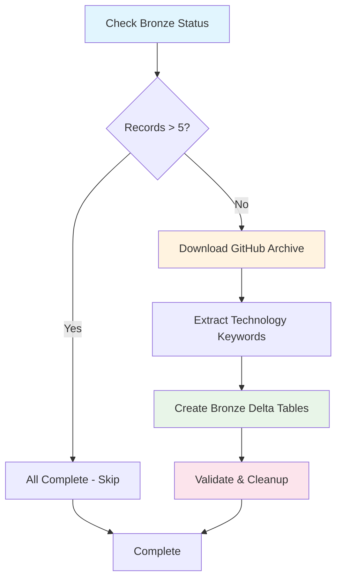

# GitHub Bronze Data Pipeline DAG

> **A production-ready Airflow DAG for processing GitHub Archive data into Bronze Delta Lake tables with intelligent technology trend analysis**

## 🎯 Overview

The `daily_github_bronze` DAG is a sophisticated data pipeline that processes GitHub Archive data to extract and analyze technology trends. It intelligently downloads GitHub events, extracts mentions of 700+ technology keywords from commit messages and pull requests, and stores structured results in Delta Lake format for downstream analytics.

## ✨ Key Features

- **🧠 Smart Idempotency**: Uses Delta table utilities for fast completion checks (>5 records = complete)
- **📅 Sequential Processing**: Processes dates chronologically from configurable start date to yesterday
- **💾 Memory Efficient**: Optimized Parquet intermediate storage with guaranteed cleanup
- **🛡️ Resource Safe**: Single-threaded execution prevents resource conflicts and OOM errors
- **🏗️ Battle-Tested Configuration**: Uses proven Spark S3A settings that work reliably
- **🌍 Environment Agnostic**: Unified MinIO S3 storage for both Mac development and VPS production
- **📊 Comprehensive Analysis**: Tracks 700+ technologies across AI/ML, frameworks, languages, and tools
- **🔄 Fault Tolerant**: Robust error handling with detailed logging and recovery guidance

## 🔄 DAG Workflow



## 📊 Technology Coverage

The pipeline analyzes GitHub events to track mentions across **700+ technologies**:

### 🤖 AI/ML Models & Services
- **Large Language Models**: GPT-4, Claude 4, LLaMA 3.3, Mistral, Gemini, etc.
- **AI Frameworks**: LangChain, Transformers, LlamaIndex, AutoGen, CrewAI
- **ML Libraries**: PyTorch, TensorFlow, scikit-learn, Hugging Face
- **AI Techniques**: RAG, fine-tuning, LoRA, quantization, prompt engineering

### 🚀 Development Frameworks
- **Frontend**: React, Next.js, Vue.js, Angular, Svelte, Astro
- **Backend**: Django, FastAPI, Express, NestJS, Spring Boot, Laravel
- **Mobile**: React Native, Flutter, Expo, SwiftUI, Jetpack Compose
- **Desktop**: Electron, Tauri, Qt, WPF

### 💻 Programming Languages
- **Modern**: TypeScript, Rust, Go, Kotlin, Swift, Dart
- **Established**: Python, JavaScript, Java, C#, PHP, Ruby
- **Emerging**: Zig, Mojo, Crystal, Julia

### ☁️ Cloud & Infrastructure
- **Cloud Providers**: AWS, Azure, GCP, Cloudflare, Vercel
- **DevOps**: Docker, Kubernetes, Terraform, Ansible, GitHub Actions
- **Databases**: PostgreSQL, MongoDB, Redis, Snowflake, ClickHouse
- **Monitoring**: Prometheus, Grafana, Datadog, Sentry

## 🗂️ Data Architecture

### Input Data Sources
- **GitHub Archive**: Hourly JSON.gz files from `data.gharchive.org`
- **Event Types**: PushEvent, PullRequestEvent (commit messages, PR titles/descriptions)
- **Coverage**: 24 hours/day × 365 days/year of global GitHub activity

### Processing Layers
1. **Raw Layer**: GitHub Archive JSON files in MinIO S3
2. **Extraction Layer**: Parquet files with keyword mentions per hour
3. **Bronze Layer**: Delta Lake tables with standardized schema and metadata
4. **Ready for Silver**: Aggregated and enriched data for analytics

### Storage Infrastructure
- **MinIO S3**: Unified object storage for both Mac development and VPS production
- **Delta Lake**: ACID transactions, time travel, and schema evolution
- **Partitioning**: Date-based partitioning for efficient querying

## ⚙️ Task Breakdown

### 1. `check_bronze_status` (✅ Fast Python Check)
- **Purpose**: Determine next unprocessed date using Delta table utilities
- **Logic**: Uses `delta_table_utils.py` for fast record counting
- **Threshold**: Date complete if Bronze table has >5 records
- **Output**: XCom variables for downstream tasks

```python
# Uses fast Delta table checking
count = get_table_count_for_date("keyword_extractions", date_str)
return count > MIN_RECORDS_THRESHOLD
```

### 2. `download_and_extract` (📥 Data Acquisition)
- **Downloads**: 24 hourly GitHub Archive files for target date
- **Extraction**: Processes events with 700+ technology keyword patterns
- **Output**: Hourly Parquet files in Bronze layer
- **Caching**: Skips already downloaded files for efficiency

```python
# Processes ~1-5GB of compressed GitHub data per day
# Extracts technology mentions from commit messages and PR descriptions
# Saves intermediate results as Parquet for memory efficiency
```

### 3. `create_bronze_delta` (🔥 Battle-Tested Spark)
- **Engine**: Spark with proven S3A configuration
- **Input**: Hourly Parquet files from extraction
- **Processing**: Consolidates, enriches, and validates data
- **Output**: Append to Bronze Delta table with ACID guarantees

```bash
# Uses EXACT same JAR versions and S3A config as working scripts
# Proven memory settings: 1.5GB driver, 1GB executor
# Guaranteed cleanup on both success and failure
```

### 4. `post_bronze_cleanup` (🧹 Validation & Cleanup)
- **Validation**: Confirms Bronze table has required record count
- **Cleanup**: Removes temporary Parquet files after successful validation
- **Preservation**: Keeps Delta table as permanent storage
- **Reporting**: Provides completion statistics and next steps

## 📈 Bronze Schema

The Bronze Delta tables use this optimized schema:

```sql
CREATE TABLE keyword_extractions (
    -- Partitioning
    date STRING,                    -- YYYY-MM-DD (partition key)
    
    -- Time dimension
    hour INTEGER,                   -- 0-23
    
    -- Technology tracking
    keyword STRING,                 -- Technology keyword found
    mentions INTEGER,               -- Count of mentions in that hour
    
    -- Repository context
    top_repo STRING,                -- Repository with most mentions
    repo_mentions INTEGER,          -- Mentions in top repository
    event_mentions INTEGER,         -- Total event mentions
    
    -- Metadata
    source_file STRING,             -- Original GitHub Archive file
    processing_time TIMESTAMP       -- When record was created
)
USING DELTA
PARTITIONED BY (date)
LOCATION 's3a://delta-lake/bronze/github/keyword_extractions'
```

## 🔧 Configuration

### Environment Variables (Required)
```bash
# MinIO S3 Storage
MINIO_ACCESS_KEY=your_access_key
MINIO_SECRET_KEY=your_secret_key
MINIO_ENDPOINT=localhost:9000        # Mac: localhost:9000, VPS: vps_ip:9000
MINIO_BUCKET=delta-lake

# Airflow Environment
AIRFLOW_ENV=mac                      # 'mac' or 'vps'
```

### DAG Configuration
```python
START_DATE = "2024-12-31"            # Begin processing from this date
MIN_RECORDS_THRESHOLD = 5            # Records needed to mark date complete
SKIP_START = None                    # Optional: skip date range start
SKIP_END = None                      # Optional: skip date range end
```

### Spark Configuration (Battle-Tested)
```python
# Memory settings optimized for reliability
spark.executor.memory=1g
spark.driver.memory=1500m
spark.executor.cores=1

# S3A settings that actually work
spark.hadoop.fs.s3a.endpoint=http://${MINIO_ENDPOINT}
spark.hadoop.fs.s3a.path.style.access=true
spark.hadoop.fs.s3a.connection.ssl.enabled=false
```

## 🎯 Use Cases & Analytics

### Technology Trend Analysis
- **AI Adoption**: Track mentions of GPT-4, Claude, LLaMA across time
- **Framework Wars**: React vs Vue vs Angular popularity trends
- **Language Evolution**: Python vs Rust vs Go usage patterns
- **Cloud Migration**: AWS vs Azure vs GCP adoption

### Business Intelligence
- **Market Research**: Understand developer preferences and trends
- **Product Strategy**: Identify emerging technologies and opportunities
- **Competitive Analysis**: Track technology adoption by competitors
- **Developer Relations**: Target communities using relevant technologies

### Data Science Applications
- **Time Series Analysis**: Technology popularity over time
- **Correlation Studies**: Which technologies are used together
- **Geographic Analysis**: Technology preferences by region
- **Repository Clustering**: Group projects by technology stack

## 📊 Monitoring & Observability

### Processing Statistics
```python
📊 Download Results:
   ✅ Successful: 24/24 hours
   ♻️ Cached: 0 files
   ❌ Failed: 0 downloads

📊 Extract Results:
   ✅ Successful: 24/24 hours
   ❌ Failed: 0 extractions

📊 Bronze Results:
   📈 Records for date: 1,234
   📁 Total Bronze records: 45,678
```

### Data Quality Metrics
- **Completeness**: Hours processed per date (target: 24/24)
- **Accuracy**: Keyword extraction success rate (target: >95%)
- **Consistency**: Record count validation (target: >5 per date)
- **Timeliness**: Processing lag behind GitHub Archive availability

### Error Handling & Recovery
```python
# Detailed error reporting with recovery guidance
❌ Error in download/extract: Connection timeout
💡 Troubleshooting:
   • Check GitHub Archive availability
   • Verify MinIO connectivity
   • Review network configuration
   • Consider retry after cooldown period
```

## 🔄 Idempotency & Smart Processing

### Delta Table Checking
```python
# Fast completion check using delta_table_utils
from include.utils.delta_table_utils import get_table_count_for_date

def is_date_complete(date_str):
    count = get_table_count_for_date("keyword_extractions", date_str)
    return count is not None and count > 5
```

### Sequential Processing Logic
```python
# Processes dates chronologically from START_DATE to yesterday
# Automatically finds next unprocessed date
# Respects optional SKIP_START/SKIP_END ranges for maintenance
```

### Recovery Mechanisms
- **Task-Level**: Each task can restart independently
- **Date-Level**: Failed dates can be reprocessed without affecting others
- **Data-Level**: Partial data is cleaned up to enable clean retries

## 📋 Dependencies & Integration

### Core Modules
```python
# Environment detection and configuration
from include.config.env_detection import ENV

# GitHub data acquisition
from include.github.downloader import download_github_date
from include.github.keyword_extractor import extract_keywords_for_date

# Delta table utilities for fast checks
from include.utils.delta_table_utils import get_table_count_for_date

# Storage management
from include.storage.file_manager import delete_files_from_layer
```

### External Dependencies
```bash
# Python packages
deltalake>=0.15.0                   # Delta table operations
pyarrow>=12.0.0                     # Parquet processing
pandas>=1.5.0                       # Data manipulation
boto3>=1.26.0                       # S3 operations
requests>=2.28.0                    # HTTP downloads

# Spark JARs (exact versions that work)
hadoop-aws-3.3.6.jar
aws-java-sdk-bundle-1.12.367.jar
delta-spark_2.13-4.0.0.jar
delta-storage-4.0.0.jar
```

### Infrastructure Requirements
```yaml
# MinIO S3 storage
- Bucket: delta-lake
- Paths: bronze/github/, silver/github/, gold/github/

# Apache Spark
- Version: 3.5+ with Scala 2.13
- Master: spark://spark-master:7077
- Memory: 4GB+ available cluster memory

# Apache Airflow
- Version: 2.7+
- Executor: LocalExecutor (prevents concurrency issues)
- Scheduler: Standard configuration
```

## 🚀 Getting Started

### 1. Environment Setup
```bash
# Set required environment variables
export MINIO_ACCESS_KEY=your_access_key
export MINIO_SECRET_KEY=your_secret_key
export MINIO_ENDPOINT=localhost:9000
export MINIO_BUCKET=delta-lake
export AIRFLOW_ENV=mac
```

### 2. Manual Testing
```bash
# Test Delta table utilities
python include/utils/delta_table_utils.py keyword_extractions --count-only

# Test single date processing
python include/spark_jobs/github_raw_to_bronze_delta.py 2024-12-31
```

### 3. DAG Deployment
```bash
# Copy DAG to Airflow
cp daily_github_bronze.py $AIRFLOW_HOME/dags/

# Trigger DAG
airflow dags trigger daily_github_bronze
```

### 4. Monitoring
```bash
# Check DAG status
airflow dags state daily_github_bronze

# View task logs
airflow tasks logs daily_github_bronze check_bronze_status
```

## 🎯 Production Readiness

This DAG is designed for production use with:

- ✅ **Proven Configurations**: Battle-tested Spark and S3A settings
- ✅ **Resource Management**: Memory-optimized with guaranteed cleanup
- ✅ **Error Handling**: Comprehensive error reporting and recovery
- ✅ **Monitoring**: Detailed logging and observability
- ✅ **Scalability**: Handles large GitHub Archive datasets efficiently
- ✅ **Maintainability**: Modular design with clear separation of concerns

The pipeline reliably processes 1-5GB of compressed GitHub data daily, extracting valuable technology trend insights for data-driven decision making.